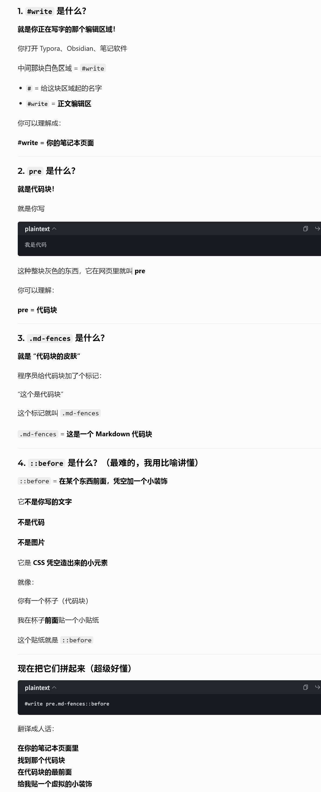

# CSS

**用“typora”的“开发者模式的元素追踪”就能找到对应的所有信息！！**

# 基本语法和逻辑

- 选择器：
  - 类选择器：.md-fences、.code-tooltip
  - 标签选择器：code、tt
  - ID + 后代 + 伪元素：#write pre.md-fences::before
    这是更精确的写法，表示在 id 是 write 的区域里，找到 class 是 md-fences 的 pre 元素，并给它添加一个“虚拟前置小元素”

- 规则
  - 层叠：同一个元素可以同时被多条规则命中
  - 优先级：更具体的选择器，通常会覆盖更普通的
  - 顺序：优先级一样时，后写的覆盖先写的
    - 先给多个选择器设置通用值，后面再单独覆盖特定选择器的值
    - 条件覆盖：不同容器，不同状态下有不同的样式需求

```css

选择器 {
  属性: 值;
  属性: 值;
}

/* 第一组：给三种元素统一设置背景色 */
.md-fences,
code,
tt {
    background-color: #f8f8f8; /* 浅灰色背景 */
}

/* 第二组：单独给 code 元素覆盖背景色 */
code {
    background-color: #9db680b0; /* 淡绿色半透明背景 */
}

/* 
 * 代码块前面的三色小点：
 * 
 * # = id选择器，选中id=“write”的元素
 * pre，选中<pre>标签
 * .md-fences，选中class=“md-fences”
 * ::before，选中前置伪元素（元素前面加一个虚拟小元素）
 * 加起来就是：在id=“write”的区域里，找到class=“md-fences”的pre元素，并给它添加一个“虚拟前置小元素”
*/
#write pre.md-fences::before {
    content: "";
    position: absolute;
}
```


