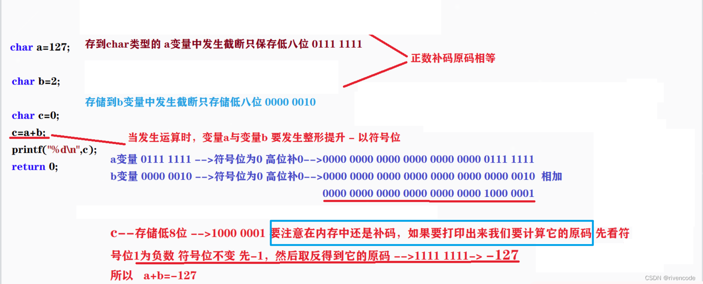

# C

## 数据类型

### 作用

- 决定开辟的内存大小
  - `float`: 4字节
  - `double`: 8字节

- 决定数据在内存中如何存储（存进去）
  - 整型（原码、反码、补码：第一位是符号位，0为正数）
    
    - 原码：`-128：1000 0000`
    - 反码（前提是有符号的负数）：符号位不变，其余位按位取反
    - 补码（前提是有符号的负数）：**所有内存中的数据都是以补码形式存储的，所有运算也是用的补码（加减乘除，&，^，|，~【符号位也反转】）**
      - 示例：`uint -10` 转为 `1111 1111 1111 1111 1111 1111 1111 0110` 存储到开辟的四字节中（这个过程不理会数据类型是什么）
    
    - 类型提升：
      - 场景：
        - 表达式中：函数调用（`printf`），赋值（**不是声明:`char a = 128`**），运算，条件判断
        - 函数参数传递
        - …………
         
      - 规则：根据寄存器的位数对**补码**进行提升
        - 有符号 
          - 符号位为0，高位补0
          - 符号位为1，高位补1 
        - 无符号
          - 高位补0
         
      - 示例：
        ```c
          #include <stdio.h>
          int main()
          {
              char a = -128;
              printf("%u\n", a);
              return 0;
          }
          -->-128的补码存储-->printf时类型提升-->用%u来解析，转为原码二进制（这个时候不是用类型来解析了）4294967168
          ```
        
        ```c
          int main()
          unsigned char i = 0;
          for(i = 0; i <= 255; i++)
          {
            printf("%u\n", i);
            Sleep(50); // 延时50ms
          }
          return 0;

          -->i一直加到255-->255 1的补码进行提升并且相加-->1 0000 0000 0000 0000 0000 0000 0000 0000-->结果进行高位截断-->0000 0000提升并且给printf
        ```

        ```c
        char a = 127,b = 2;
        char c = a+b;
        printf("%d\n", c);
        有符号正数：原=补
        提升并且相加之后是0~ 1000 0001（补码）
        截断放到c(**如果不定义c，直接打印a+b，则不需要截断，结果为129！！！！！！**)
        取出来，进行类型提升
        用%d解析
        ```

        

- 决定如何解析一段地址中的连续数据（取出来）
  - 根据类型判断最高位是否为符号位
  - 示例：
    ```c
    // 大小端转换，解析数据
    u8 buf[BUF_SIZE];
    u32 data = *(u32 *)buf;
    ```

## 字符串

### `<string.h>` 相关

- `strlen` 返回 `size_t`，是无符号的
  - 无符号数相加减结果仍为无符号数
  - 示例：`(size_t)4 - (size_t)6 > 0`

### 字符串常量和字符数组

- 字符串常量：
  `char *str = "hello world"`   因为是常量，所以无法修改内容;
- 字符数组：
  `char str[10] = "hello world"`

## 宏定义

### 用法
- 替换文本（仅文本，非字符串）
- 链接符
  ```c
  #define CAT(a, b) a ## b

  int main()
  { 
    int state = 0;
    printf("%d", CAT(sta, te));  
  }
  ```
### 缺点
- 宏定义占用代码空间大，每一次都是完整的替代
- 调试困难
  - 调试时看到的代码和源代码有区别，不会显示INTERVAL，只会显示100
  - 无法打断点，如果是多行宏定义，看不到过程
- 运算符优先级问题

## 结构体

声明结构体的时候只是在定义一个数据类型，不涉及内存的分配

### 字节对齐

字节对齐是为内存访问服务的——它确保 CPU 能高效（非字节对齐访问可能需要读多几次）、安全地读写数据。没有合理的对齐，内存访问可能变慢、出错，甚至导致程序崩溃。

- 小对齐

  每个成员都需要判断是否对齐（编译器决定是几字节对齐！！），是否需要在后面补字节空间
  ```c
  struct    // 假设这里编译器是4字节对齐
  {
    u8 a;   // 1字节
            // 填充3字节，4字节对齐
    int b;  
            // 4字节
    u8 c;
            // 填充3字节，4字节对齐
            // 共12字节，符合%4（int） = 0
  } test;
  ```
  ```c
  typedef struct
  {
    struct
    {
      struct ALLOC_HDR *ptr;  // 地址4字节
      unsigned int size;      // 4
    } s;  // 刚好8

    unsigned int align;       // 4
    unsigned int pad;         // 4
  } ALLOC_HDR;  // 刚好16 % 8 = 0
  ```
tips：定义结构体的时候，把相同大小的成员放在一起，可以减少填充字节数

- 大对齐
  
  总字节大小必须是其最宽成员的字节数的整数倍

## 联合体

共用一片内存空间

## 关键字

### const

不是真正的常量，`const u8 size = 100;`  `uint8_t arr[size]`会报错

- 修饰变量：
  变量不能直接**修改**(可以地址修改)

- 修饰指针
  不修饰数据类型！所以右边离谁近修饰谁
  `const uint8_t *p = arr;`
  `uint8_t const *p = arr;`
  `uint8_t *const p = arr;`

### volatile

一个变量可能被外部（硬件）修改，尽管我们写的语句可能不涉及这个变量。这是需要cpu重新从**内存**读取这个变量的now值

### sizeof

获取变量的数据类型的大小。

避免数组进行指针退化的其中一种方式`sizeof(arr) = 整个数组所占的字节数`

## 计算机框架

### 运算单元

- CPU：
  从内存中取数据，运算，将结果存回内存（直接从硬件读取速度慢）

### 存储单元

#### 内存

- 特点：
  速度快（电子运动），掉电丢失

##### FLASH

- RO（Read Only）段
  - text段：
    代码段+只读常量

##### ROM

##### RAM（临时随机存储器Random Access Memory）

- ZI（Zero Initialized）段
  - 栈Stack（自动分配内存） 
  
  - 堆Heap（手动分配内存）
  
    动态内存分配在堆区
  
  - BSS

- RW（Read Write）段
  - data段

#### 硬盘

- 特点：
  存储空间大，速度慢（机械运动）

## 字节对齐

### 结构体、联合体字节对齐
  
### 地址字节对齐
  
  一个变量起始地址是 4 的整数倍，那么就说他是“四字节对齐”，32位单片机普遍使用 4 字节对齐，有的必须要字节对齐内存访问，有的支持非对齐内存访问

  tips：任意能被4整除的数，其二进制的最低两位一定是 0

## 内存分配

### 静态分配

### 动态分配

需要手动管理，容易造成内存碎片化，访问速度慢？？？

- 分配在堆区（手动分配的特点，所以可以动态调整，减少对程序的影响）
- `malloc` 函数使用必须要检查返回值（是否申请成功）
- `free` 函数需要及时使用（否则可能导致内存泄露）；指针也要null放空（否则会导致野指针）
  - 内存泄露：
    大量内存申请之后未得到及时释放，导致内存空间不足
- `realloc` 重新分配内存大小
  - 原空间后续空间足够：
    在原空间后增加
  - 原空间后续空间不够：
    创建新的空间，将原空间内容复制过去，释放原空间（返回值可能是null，所以不能用原空间地址）

#### 柔性数组

结构体的最后一个成员是未知大小的数组

特点：
 - 该结构体至少要有一个成员，才能到柔性数组
 - sizeof的返回值不包括柔性数组

## 其他小知识

### 数组的指针退化

只有sizeof和&会保持数组的整体性，其余都会退化成首元素的指针
```c
#define ARR_SIZE(arr) (sizeof(arr) / sizeof((arr)[0]))
void func(int *data)
{
    printf(("length: %d\n"), ARR_SIZE(data));
}

// 结果是2：指针大小（x86）8 / 4 = 2
```
`int arr[3][3]`:
`&data + 1`步长是整个数组的大小 <—— &data 是指向整个数组的指针，类型是 int (*)[3][3]
`data + 1`步长是首元素的类型，即int (*)[3];