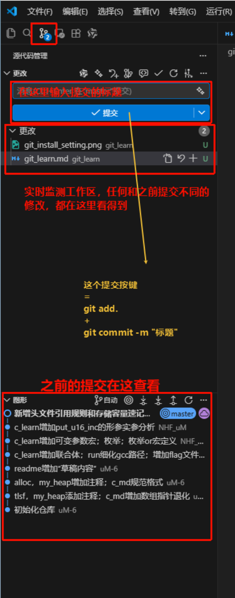
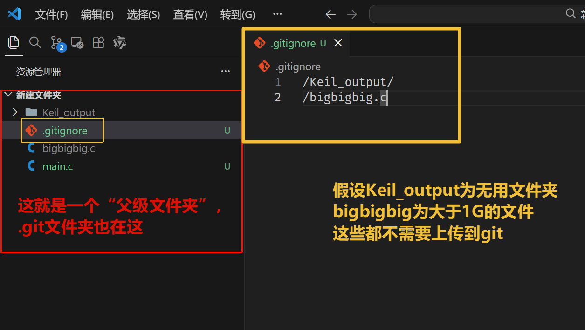

# Git 

## 安装

1. 打开 git 官网
2. 除了图片的设置外，其他均可保持默认

.git 文件夹（存储项目的 git 信息）是隐藏的，需要在文件夹选项中显示隐藏的文件。

## 本质理解

### 快照信息

由工作区和暂存区组成

### Commit （提交）

1. 快照信息（工作区 + 暂存区）
2. 创建者，创建时间，创建信息
3. 指向父提交的指针（可以有两个父提交——merge 的时候）【从事情发展的角度看，是旧的提交指向新的，但本质上是新的指向旧的】

### Branch（分支）

一个“指针”，指向某个提交（的哈希值）

1. 创建新提交时，并且让分支指向新提交
2. 分支会关联提交和提交所关联的所有父提交
3. 切换分支等操作后，分支会自动指向最新的提交

### HEAD

也是一个“指针”

1. 直接展示当前的工作区，永远指向当前正在工作的快照（包括工作区和暂存区）
2. 默认指向分支，分支会自动指向最新的提交
3. 也可以直接指向提交，这时候我们称之为“分离 HEAD”（没有从 HEAD 到 Branch 到 Commit 的过程）
   1. 分离 HEAD，如果创建新提交，那这个提交就不属于任何分支，被判定为孤立提交（在 gitGraph 上没有标签指向的提交将被隐藏，一段时间之后会被 git 删除）
   2. 分离 HEAD 之后，需要创建一个新的分支再进行提交（重新用一个分支标签指回去，让其能够稳定存在）

## 分区

- 工作区：当前正在编辑的区域（由“未提交代码”和“已提交代码的本地副本”共同构成）
- 暂存区：`git add .` 之后的文件（全都是“未提交代码”）
  - 精细拆分提交（没有暂存区只能一起提交，历史混乱）——提供一次只提交一个功能的机会
  - 避免误提交（多了一次检查的机会）
  - 支持“半成品”暂存（暂存未完成的文件，存了之后即使不提交也能切换分支，不用担心丢失进度）

## 状态

- 未提交的代码：可以理解为一份“游离草稿”，不属于任何分支，提交之后就变成了“正式文档”，也就是本地仓库的内容
- 本地仓库：`git commit` 之后的文件（已提交的代码，“正式文档”）

## 操作

### 初始化 git 仓库

1. `git init`：在当前目录下初始化一个新的 git 仓库，创建 .git 文件夹
2. ⚠️：初始化的对象是 .git 文件夹的上一层文件夹（以后都称为“父级文件夹”），在这个文件夹下的所有文件都会被 git 管理，在这个文件夹上的文件不归它管理

### 提交

1. `git add .`：将工作区的所有更改（‘.’表示所有）添加到暂存区
2. `git commit -m "提交信息"`：将暂存区的更改提交到本地仓库

3. ⚠️：提交应该遵循原子化，即每次提交只包含一个功能的更改，提交信息应该清晰描述更改内容（尽量遵守就好）

### 切换 HEAD（重置快照）

1. `git switch <branch-name>`：切换到指定分支（）
2. `git switch <commit-hash>`：切换到指定提交的状态（分离 HEAD）
3. ⚠️：`switch` 最常用的是查看历史提交的代码，如果需要根据那次的提交进行修改，就需要创建一个新的分支指向那个提交，并且在新的分支上进行开发
4. `git checkout`和`git switch`区别在前者多了一个撤销修改的功能，导致误操作较多，后者只能够做到纯粹的切换HEAD

切换 HEAD 的两种情况：

- “当前工作区和暂存区的 **已提交的代码**”和“切换后的工作区和暂存区”完全一致：直接切换，把未提交的内容（“游离草稿”）也一起带过去
- “当前工作区和暂存区的 **已提交的代码**”和“切换后的工作区和暂存区”不一致：提示需要先处理未提交的代码
  - 满足主观的提交要求：暂存+提交
  - 不满足主观的提交要求：
    - 暂存+备份（`git stash`）：将未提交的代码保存到一个**临时**区域，切换后再恢复（`git stash pop`）
    - 直接放弃

### 不追踪某些文件的修改（比如大小很大的文件，或者频繁修改且不重要的文件）

1. 在“父级文件夹”下创建 `.gitignore` 文件，列出需要忽略的文件或文件夹

不能删除当前分支——需要切换到其他分支
