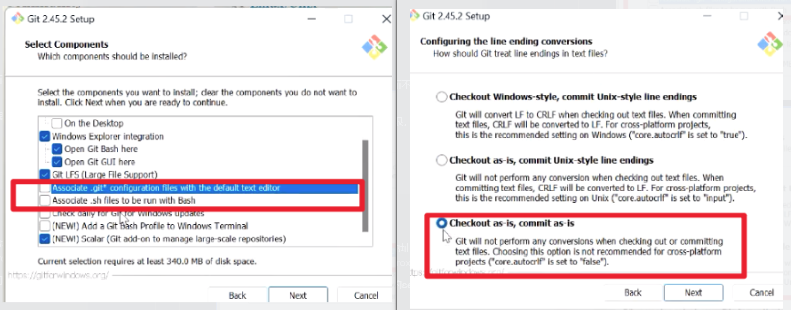

安装：
    1. 打开git官网
    2. 除了图片的设置外，其他均可保持默认
    

.git文件夹（存储项目的git信息）是隐藏的，需要在文件夹选项中显示隐藏的文件

本质：
    提交包括三个信息
        指向完整快照的指针
        创建者，创建时间，创建信息
        指向父提交的指针（可以有两个父提交——merge的时候）【从事情发展的角度看，是旧的指向新的，但本质上是新的保存旧的】

    分支是一个“指针”，指向某个提交（的哈希值）
        创建新提交时，并且让分支指向新提交
        分支会关联提交和提交所关联的所有父提交

    HEAD也是一个“指针”
        默认指向分支，分支再指向提交
        当直接指向提交的时候，我们称为分离HEAD（没有从HEAD到Branch到commit的过程）
            分离HEAD，如果创建新提交，那这个提交就不属于任何分支，被判定为孤立提交（在gitGraph上没有标签指向的提交将被隐藏，一段时间之后会被git删除）
                分离HEAD之后，需要创建一个新的分支再进行提交（重新用一个分支标签指回去，让其能够稳定存在）

状态
- 工作区：当前正在编辑的文件
- 暂存区：git add之后的文件（允许你选择性地提交更改，不一定是一次性提交）
- 本地仓库：git commit之后的文件

不能删除当前分支——需要切换到其他分支
