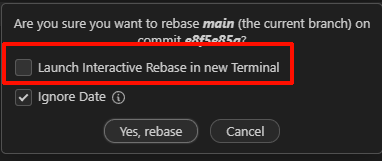
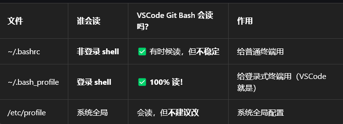

# Git

## 安装和配置

> 安装直接去 git 官网

```bash
记得用系统级终端运行

git config --global user.name "NHF_uM"

git config --global user.email "2844588775@qq.com"
```


## 分区

- 工作区：当前正在编辑的区域（由“未提交代码”和“已提交代码”共同构成）
- 暂存区：`git add` 之后的文件（全都是“未提交代码”）
  - 精细拆分提交（没有暂存区只能一起提交，历史混乱）——提供一次只提交一个功能的机会
  - 避免误提交（多了一次检查的机会）
  - 支持“半成品”暂存（暂存未完成的文件，存了之后即使不提交也能切换分支，不用担心丢失进度）
- 仓库：提交后的代码

## 理解本质

### 快照信息

由工作区和暂存区组成

### Commit （提交）

1. 提交只提交“暂存区”
2. 包含创建者、创建时间、创建信息、指向父提交的指针【从事情发展的角度看，是旧的提交指向新的，但本质上是新的指向旧的】

### Branch（分支）

一个“指针”，指向某个提交（的哈希值）

1. 创建新提交时，同时会让分支指向新提交(管理了一条枝干)
2. 切换分支等操作后，分支会自动指向最新的提交

分支：验证新功能/修复旧代码/每人一个分支独立开发/…………     最终都是要合并到主分支的

### HEAD

也是一个“指针”

1. 永远指向当前正在工作的区域（工作区和暂存区）
2. 默认指向分支，分支会自动指向最新的提交
3. 也可以直接指向提交，这时候我们称之为“分离 HEAD”（没有从 HEAD 到 Branch 到 Commit 的过程）
   1. 分离 HEAD，如果创建新提交，那这个提交就不属于任何分支，被判定为孤立提交（在 gitGraph 上没有标签指向的提交将被隐藏，一段时间之后会被 git 删除）
   2. 分离 HEAD 之后，需要创建一个新的分支再进行提交（重新用一个分支标签指回去，让其能够稳定存在）

>分离节点：不被任何“指针”指向或关联，一段时间后会被 git 回收机制清除

## 状态

- 未提交的代码：可以理解为一份“游离草稿”，不属于任何分支，提交之后就变成了“正式文档”，也就是本地仓库的内容
- 本地仓库：`git commit` 之后的文件（已提交的代码，“正式文档”）

## 操作

### 暂存与提交

1. `git add .`：将工作区的所有更改（‘.’表示所有）添加到暂存区
2. `git commit -m "提交信息"`：将暂存区的更改提交到本地仓库

### 切换 HEAD（重置工作区和暂存区）

1. `git switch <branch-name>`：切换到指定分支（）
2. `git switch <commit-hash>`：切换到指定提交的状态（分离 HEAD）
3. `git checkout` 和 `git switch` 区别在前者多了一个撤销修改的功能，导致误操作较多，后者只能够做到纯粹的切换 HEAD

切换 HEAD 的两种情况：

- “当前工作区和暂存区的 **已提交的代码**”和“切换后的工作区和暂存区”完全一致：直接切换，把未提交的内容（“游离草稿”）也一起带过去（不改变工作区）
- “当前工作区和暂存区的 **已提交的代码**”和“切换后的工作区和暂存区”不一致：提示需要先处理未提交的代码
  - 满足主观的提交要求：暂存+提交
  - 不满足主观的提交要求：
    - 暂存+备份（`git stash`）：将未提交的代码保存到一个 **临时** 区域，切换后再恢复（`git stash pop`）
    - 直接放弃

### 暂存 Stash

存的是所有“未提交的代码”（无论是否 add）

- `git stash`：将当前的“未提交的代码”保存到一个 **临时** 区域（本地）
- `git stash save "我存的是：登录功能代码"`：给 stash 添加一个描述信息，方便后续查看
- `git stash list`：查看所有的 stash 条目
- `git stash pop`：取出最近一次的 stash 条目，并将其从 stash 列表中删除
- `git stash apply`：取出最近一次的 stash 条目，但不删除
- `git stash drop`：删除指定的 stash 条目
- 后跟 stash 条目编号（比如 `git stash pop stash@{2}`）可以指定操作特定的 stash 条目![(gitignore_vscode.png)

### 合并 Merge（会产生新的提交）

- 找到公共节点，一路到最新节点
- 融合两条分支，在目标分支生成一个新的提交

在分支 fun_1 中完成修改，需要合并回 main 分支：

1. 确保自己在 fun_1 中，`git merge main` 对齐主线，提前解决所有的冲突
2. 切换到 main 中，`git merge fun_1` 把分支合并回主线

#### 快速合并 Fast-forward

Git 发现你的分支完全是主线的 “后代”，直接把主线指针往前挪一步，完成合并

### 基变 Rebase（不会产生新的提交，但会修改提交历史）

使用它而不是 merge 最大的原因是能保持 git 的节点简洁

- 找到公共分支，**依次**（有多少个节点发生冲突，就要解决多少次）复制分支链上的各个节点到目标分支（位置不同，复制前后的节点的哈希值也不相同）
- 原本的节点将不再被本机分支指向，但没有消失，如果没有被远程分支指向的话将变成分离节点（保持历史整洁）
- 分支链上的子分支不在基变范围内（团队协作里风险很高）

在分支 fun_2 中完成修改，需要基变回 main 分支：

1. 确保自己在 fun_2 中，`git rebase main`
   - 发生冲突，解决冲突并且 `git add`+`git rebase --continue`
   - 中途放弃，回到操作前状态，`git cherry-pick --abort`

2. 如果要推送，要用 push -f

>复杂链式结构使用 rebase 很容易导致代码的丢失，少用
>
>---
>
>多人协作，每人一个功能分支（没有其他人的干扰），用 rebase 把整条分支 **连根拔起**，挪个位置，简化 git 图
>
>---
>
>想要在分支链中途加入一个节点
>
>1. 切换 HEAD
>2. 创建新分支
>3. rebase 剩余节点（连根拔起）到新分支
>4. 删除旧分支（如果有），让原节点“分离”

#### 交互式基变 Rebase -i

##### 前置准备

1. 下载 GitLens 拓展
2. `git config --global core.editor "code --wait"`
    - 把 vscode 设置为默认的 git 编辑器

    - `--wait` 让 Git 进程处于等待状态，直到你在 VS Code 中编辑完成并关闭文件窗口，Git 才会继续执行后续操作

3. 在 Git Graph 中点击 Rebase 之后选择 `Launch Interactive Rebase in new Terminal`
    

4. 

##### Pick 保留

##### Reword 重写

只修改“提交（标题）信息”

##### Edit 编辑提交

修改“提交内容”

##### Squash（向前）压缩

多个节点压缩为一个（根节点不能压缩）

##### 修复提交

##### 丢弃提交

删除单一/某几个节点

### Ignore 和 取消追踪

`git rm -f --cached ./…………`

> .gitignore
>
> > mdk/*
> >
> > ! mdk/*.uvprojx

### 摘樱桃 Cherry pick

- 只需要某单独的 n 个提交的代码（比如底层接口修改了，要同步），不希望通过 merge 污染自己的分支
- 采取复制的方式，并非完全“摘下”
- 会形成一个新的节点！
- 默认保留原作者的名字和提交时间

在自己的分支上，需要 cherry pick 了

1. 切换到自己的分支
2. 摘樱桃 `git cherry-pick \<commit-id\>`
   - 如果有冲突，`git add`+`git cherry-pick --continue`
   - 中途放弃，回到操作前状态，`git cherry-pick --abort`
   - 只把提交内容拿过来，不自动提交，`git cherry-pick -n <commit-id>`
   - 保留提交来源，`git cherry-pick -x <commit-id>`

### 远程仓库 Remote

.git 文件夹中存放相关配置

- 查看当前状态，`git remote -v`
- 绑定远程仓库（<u>给远程仓库起别名</u>），`git remote add origin https://github.com/……`
- 修改远程仓库地址（<u>给远程仓库起别名</u>），`git remote set-url origin https://github.com/…………`
- 清除仓库绑定，`git remote remove origin`

> 远程仓库的别名——在 push 和 fetch 的时候，代替 URL——`git push origin main`

### 拉取代码

1. 首次拉取，`git clone URL`
    1. 具体分支，`git clone -b branch_name URL`
    2. 自定义文件夹名字，`git clone URL new_name`
2. 拉取+合并到本地，`git pull origin branch_name`
3. 拉取+放到远程仓库+不合并
    1. 拉取，`git fetch`
    2. 手动合并，`git merge`

## Git Bash

### 特性

执行两条命令

- && 前一条执行成功，执行第二条
- ；不论前一条结果，执行第二条

### 环境变量

默认会继承系统的环境变量，**需要重启一个 bash 才能生效**，但是系统环境变量优先级较低（如果高优先级有输出，低优先级执行不到）

>VSCode 集成的 Git Bash 默认启动的是：`bash --login`
>它只读 .bash_profile 或 .profile，完全不读 .bashrc！
>
>所以对于 python：
>
>`echo 'export PATH="/c/msys64/ucrt64/bin:$PATH"' >> ~/.bashrc` 不可用
>
>`echo 'export PATH="/c/msys64/ucrt64/bin:$PATH"' >> ~/.bash_profile`  + `source ~/.bash_profile` 可用

### 别名

- 类似于宏定义，所有经过终端的 **独立输入**（左右为空格）都被转换

`alias flash='. $HOME/esp/esp-idf/export.sh && ~/esp32c3-up/bt_ota/my_flash.sh'`

