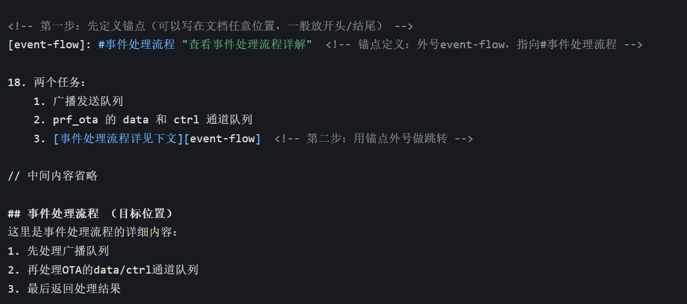
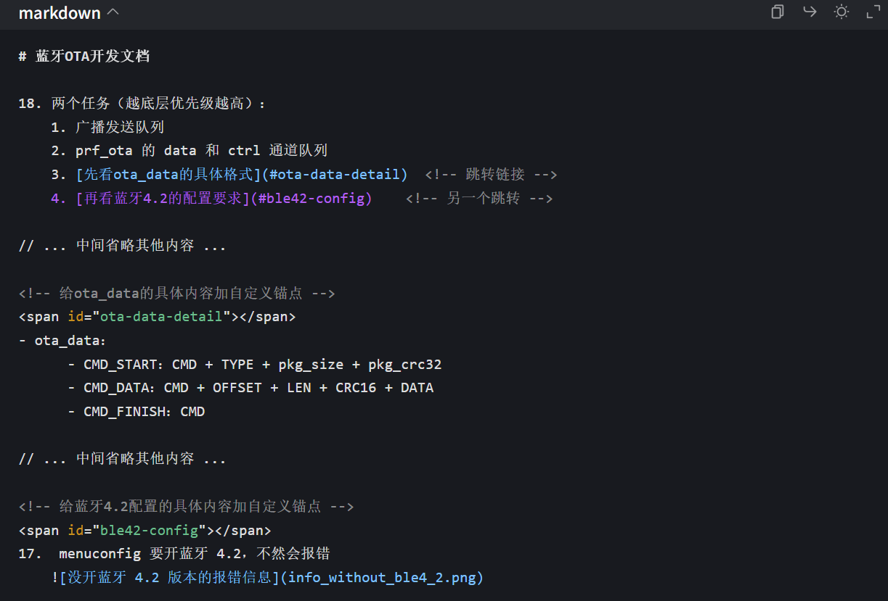

# Markdown 书写规范（精确到空格 / 换行）

## 一、标题与换行规范（融合展示）

### 1.1 标题（Heading）

标题核心规则：

- `#` 与标题文字之间必须有 **1 个空格**
- 末尾无多余空格
- 换行表示标题结束
- `#` 数量对应标题级别（1-6 级）

#### 标题层级示例（可直接渲染查看）

# 一级标题（1个# + 1个空格 + 文字）
## 二级标题（2个# + 1个空格 + 文字）
### 三级标题（3个# + 1个空格 + 文字）
#### 四级标题（4个# + 1个空格 + 文字）
##### 五级标题（5个# + 1个空格 + 文字）
###### 六级标题（6个# + 1个空格 + 文字）

### 1.2 换行与段落（放到标题结构中演示）

规则说明：

1. 段落分隔：段落之间用 **2 个连续换行**
2. 强制换行：行尾加 **2 个空格 + 1 个换行**
3. 标题后正文：标题与正文之间建议空 1 行

#### 标题与换行示例

这是标题后的第一段正文，末尾无空格。

这是第二段正文（与上一段之间有 1 个空行，所以是新段落）。  
这一行会紧跟上一行显示为“强制换行”效果（因为上一行行尾有两个空格）。

---

## 二、列表规范（含多级嵌套，融合展示）

### 2.1 无序列表/有序列表

规则：

- 文字之前必须有 **1 个空格**
- 子列表前加 **4 个空格**

示例：

1. 一级有序列表项
    - 二级嵌套无序列表项（前置4空格）
    - 二级嵌套无序列表项
        1. 三级嵌套有序列表项（前置8空格）
        2. 三级嵌套有序列表项
2. 一级有序列表项
3. 一级有序列表项

* 星号标识的无序列表（`*` + 1空格 + 文字）
+ 加号标识的无序列表（`+` + 1空格 + 文字）

## 三、文本强调规范

规则：

- 斜体：前后各 1 个 `*` 或 `_`
- 粗体：前后各 2 个 `*` 或 `_`
- 粗斜体：前后各 3 个 `*` 或 `_`
- 符号与文字之间**无空格**

示例：

*斜体文字*  
_斜体文字_  
**粗体文字**  
__粗体文字__  
***粗斜体文字***  
___粗斜体文字___

---

## 四、链接与图片规范

### 4.1 链接（Link）

规则：

- 行内链接：`[链接文字](链接地址 "可选标题")`
- `]` 与 `(` 之间无空格
- 地址与可选标题之间 1 个空格
- 参考式：`[文字][标记]` + 单独行 `[标记]: 地址 "标题"`

示例：

[百度](https://www.baidu.com "百度首页")  
[谷歌][1]

[1]: https://www.google.com "谷歌首页"

### 4.2 图片（Image）

规则：

- 图片格式与链接一致，仅多一个 `!`
- `!` 与 `[` 之间无空格

示例：

  
![示例图片2][2]

[2]: https://example.com/img2.jpg "示例图片2标题"

---

## 五、代码规范

### 5.1 行内代码

行内代码用反引号包裹，反引号与代码无空格：

行内代码示例：`print("hello")`  
行内代码带符号：`a = b + 1`

### 5.2 代码块

规则：

- 围栏式：前后各 3 个反引号，单独成行
- 开始围栏后可加语言标识（如 `python`）
- 缩进式：每行前 4 个空格（或 1 个 Tab）

示例（围栏式）：

```python
print("代码块示例")
for i in range(5):
    print(i)  # 此处有4个空格缩进
```

示例（缩进式）：

    print("缩进代码")
    if True:
        print("嵌套缩进8个空格")

---

## 六、分隔线与引用规范

### 6.1 分隔线（Horizontal Rule）

规则：

- 单独成行
- 由 3 个及以上 `*` / `-` / `_` 组成
- 上下建议留空行

示例：

---

***

___

* * *

- - -

### 6.2 引用（Blockquote）

规则：

- `>` 与文字之间 1 个空格
- 嵌套时每层增加一个 `>`（`>>`、`>>>`）

示例：

> 一级引用（`>` + 1空格 + 文字）
>> 二级嵌套引用
>>> 三级嵌套引用

> 多行引用第一行  
同一引用的续行可继续写在后面（也可每行都加 `>`，更清晰）

---

## 七、表格规范

规则：

- `|` 与文字之间推荐 1 个空格（可读性更好）
- 分隔行必须含 `-`
- 对齐语法：左对齐 `:---`、居中 `:---:`、右对齐 `---:`

示例：

| 表头1 | 表头2 | 表头3 |
| :--- | :---: | ---: |
| 内容1 | 内容2 | 内容3 |
| 内容4 | 内容5 | 内容6 |

---

## 跳转
一个 #  +  任意层级标题
[显示出来的可供点击的文字](#61-分隔线horizontal-rule) 

锚点：可以用来简化长标题


### 跳转到非标题（使用锚点）


## 总结

- 必加 1 空格场景：标题 `#` 后、列表符号后、引用 `>` 后、链接/图片中“地址与标题”之间。  
- 无空格场景：强调符号与文字间、链接 `](` 间、反引号与代码间、嵌套引用 `>>` 间。  
- 换行规则：段落分隔用空行；强制换行用“行尾 2 空格 + 换行”；标题/分隔线上下建议留空行。
